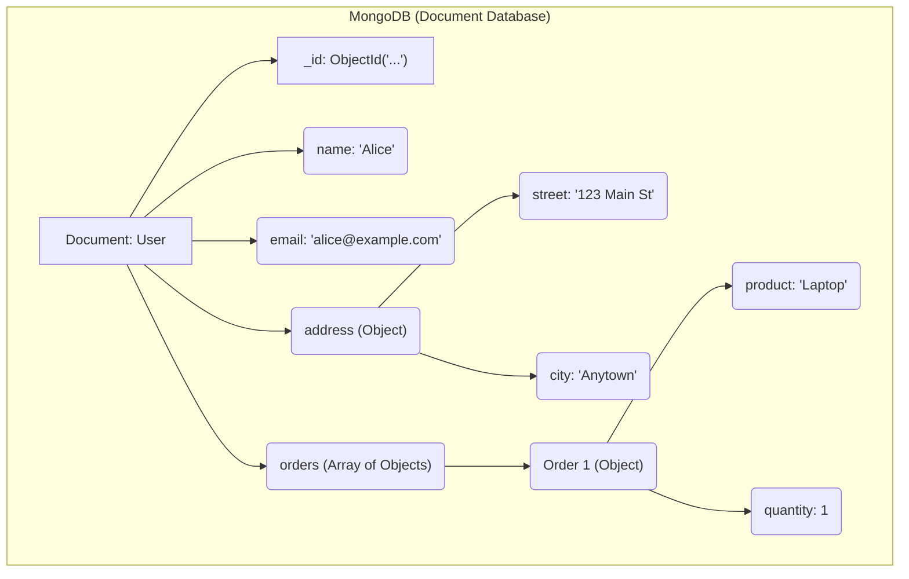

```mermaid
graph TD
    subgraph "MongoDB (Document Database)"
        Doc_User["Document: User"]
        Doc_User --> Field_ID["_id: ObjectId('...')"]
        Doc_User --> Field_Name("name: 'Alice'")
        Doc_User --> Field_Email("email: 'alice@example.com'")
        Doc_User --> Field_Address("address (Object)")
        Field_Address --> Field_Street("street: '123 Main St'")
        Field_Address --> Field_City("city: 'Anytown'")
        Doc_User --> Field_Orders("orders (Array of Objects)")
        Field_Orders --> Order1("Order 1 (Object)")
        Order1 --> Prod1("product: 'Laptop'")
        Order1 --> Qty1("quantity: 1")
    end
```