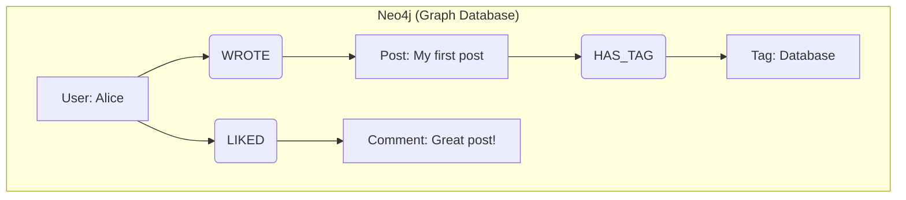

```mermaid
graph TD
    subgraph "Neo4j (Graph Database)"
        User[User: Alice] --> WROTE(WROTE) --> Post[Post: My first post]
        User --> LIKED(LIKED) --> Comment[Comment: Great post!]
        Post --> HAS_TAG(HAS_TAG) --> Tag[Tag: Database]
    end
```