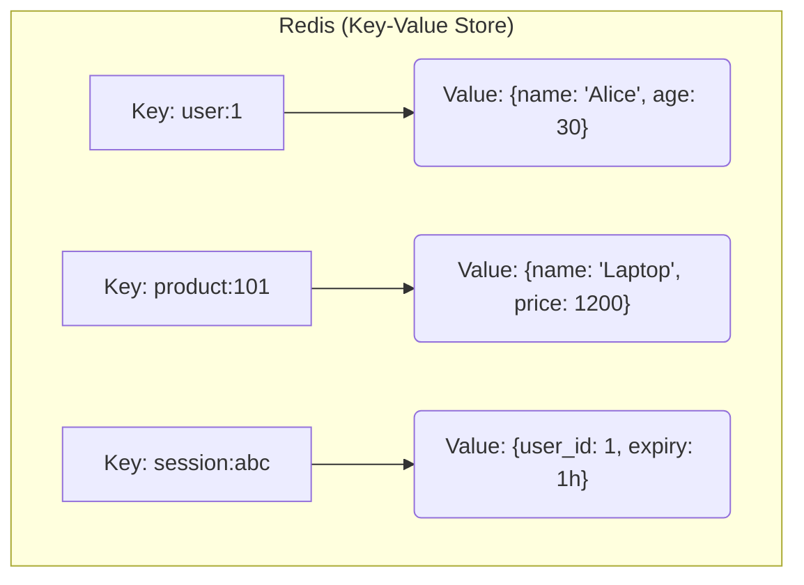

```mermaid
graph TD
    subgraph "Redis (Key-Value Store)"
        Key1["Key: user:1"] --> Value1("Value: {name: 'Alice', age: 30}")
        Key2["Key: product:101"] --> Value2("Value: {name: 'Laptop', price: 1200}")
        Key3["Key: session:abc"] --> Value3("Value: {user_id: 1, expiry: 1h}")
    end
```