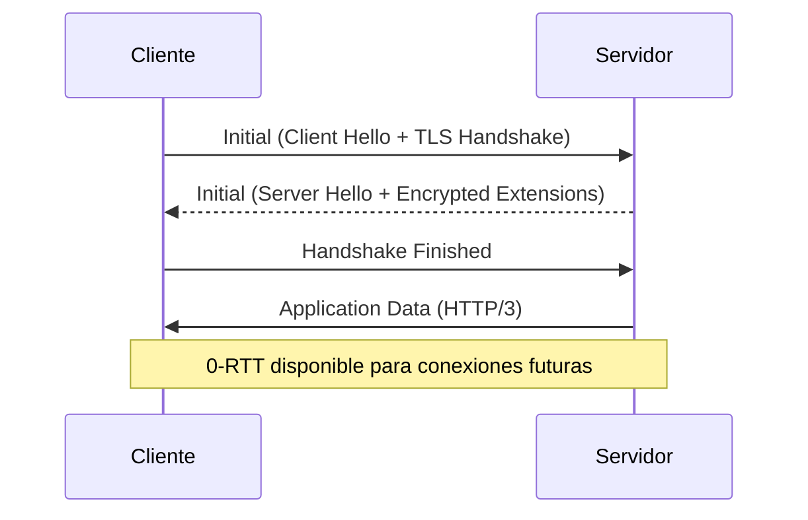

# Protocolo HTTP/3 y QUIC: Arquitectura de Red de Nueva Generación

## I. Introducción
El protocolo **HTTP/3** representa la tercera gran evolución del protocolo de transferencia de hipertexto, marcando un cambio de paradigma fundamental al abandonar el transporte sobre **TCP** (Transmission Control Protocol) en favor de **QUIC** (Quick UDP Internet Connections). Esta transición no es meramente incremental, sino arquitectónica, diseñada para resolver las latencias inherentes a las redes modernas, altamente inestables y móviles.

## II. Evolución Histórica: De SPDY a RFC 9000
El viaje comenzó con **SPDY**, un protocolo experimental desarrollado por Google para reducir la latencia de carga de páginas web mediante la multiplexación. Mientras que **HTTP/2** adoptó muchas de las lecciones de SPDY, seguía encadenado a las limitaciones de TCP. Tras años de desarrollo, la IETF formalizó **QUIC** en el **RFC 9000**, unificando la visión de un transporte basado en **UDP** que integra seguridad y control de flujo de forma nativa.

> [!note] Puerto de Operación
> A diferencia de HTTP/1.1 y HTTP/2, que operan predominantemente sobre TCP puerto 443, HTTP/3 utiliza **UDP puerto 443**. Esta decisión permite el *traversal* de firewalls modernos mientras aprovecha la naturaleza no orientada a conexión de UDP.

## III. Comparación Técnica: TCP+TLS 1.3 vs. QUIC
La limitación crítica de HTTP/2 sobre TCP es el **Head-of-Line (HoL) Blocking** a nivel de transporte. En TCP, todos los flujos de datos se entregan en un orden estricto; si un paquete se pierde, TCP detiene la entrega de todos los datos posteriores hasta que se recupere el paquete perdido.

| Característica | TCP + TLS 1.3 | QUIC (HTTP/3) |
| :--- | :--- | :--- |
| **Transporte** | TCP (Orientado a bytes) | UDP (Orientado a paquetes) |
| **Multiplexación** | HoL Blocking (Transport Layer) | Sin HoL Blocking |
| **Handshake** | 2-3 RTT | 1 RTT (o 0-RTT) |
| **Seguridad** | Capa superior (TLS) | Integrada (QUIC TLS) |

> [!info] Control de Flujo
> QUIC implementa dos niveles de control de flujo: **Stream-level** (para evitar que una petición sature un stream) y **Connection-level** (para limitar el consumo total de buffer por parte del peer).

## IV. Características Avanzadas: 0-RTT y Migración
### 0-RTT (Zero Round Trip Time)
Esta funcionalidad permite que un cliente envíe datos en el primer paquete de la reconexión si ha hablado previamente con el servidor, eliminando completamente la espera inicial.

> [!warning] Riesgo de Seguridad: Replay Attacks
> El modo **0-RTT** es vulnerable a ataques de repetición, donde un atacante intercepta y reenvía el paquete inicial. Las implementaciones deben limitar el 0-RTT a métodos seguros (como HTTP GET) o implementar contramedidas específicas.

### Migración de Conexión
QUIC utiliza **Connection IDs** en lugar de tuplas IP/Puerto. Esto permite mantener una sesión activa incluso si la dirección IP del cliente cambia.

> [!example] Escenario de Movilidad
> Un usuario visualizando un video en su smartphone sale de su casa (Wi-Fi) y se conecta a 5G. Con TCP, la conexión se habría roto y requeriría un re-handshake. Con QUIC, la sesión continúa sin interrupción, ya que el ID de conexión permanece constante pese al cambio de IP.

## V. Secuencia del Handshake
El handshake de QUIC es altamente optimizado, consolidando el establecimiento de transporte y la negociación criptográfica:

## VI. Implementación y Ecosistema
La adopción ha sido impulsada por gigantes como **Cloudflare**, **Google** y **Facebook**.
- **Servidores**: **Nginx** (vía módulo quic), **Envoy Proxy** y **Caddy** ofrecen soporte robusto.
- **Librerías**: `quiche` (Rust) es ampliamente utilizada por su seguridad, mientras que `lsquic` (C) se enfoca en alto rendimiento.

## VII. Conexiones con otros Sistemas
Esta arquitectura es vital para el desarrollo de infraestructuras modernas:
- La latencia reducida es fundamental para la [[Arquitectura de Agentes]], donde la comunicación entre agentes debe ser casi instantánea.
- Este documento sirve como estándar para la creación de documentación técnica en nuestro [[Sistemas de Gestión de Conocimiento]].
- La capacidad de resiliencia ante cambios de red es un pilar para el despliegue de [[MCP y Gestión de Contexto]] en entornos distribuidos.